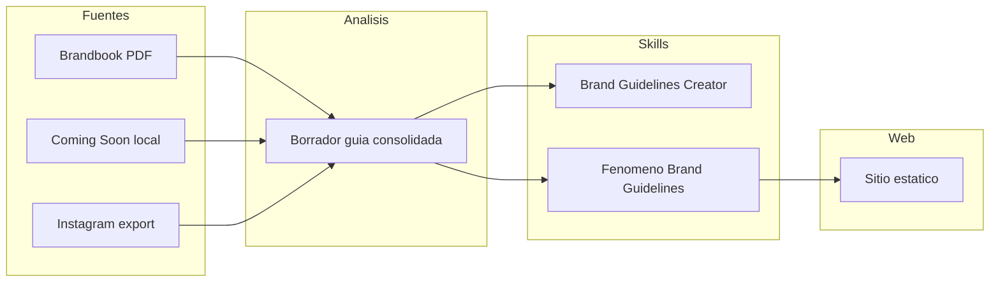

# Plan: sitio estático Fenomeno + skills de marca

## Contexto y supuestos

- Objetivo de negocio: un **sitio estático** para Fenomeno (bar en Madrid) alineado a marca.
- Ya cuentas con **contenido de Instagram descargado**, **brandbook en PDF** y **copia/mirror del sitio Coming Soon**. El glob del workspace no listó archivos en la ruta del proyecto; en la ejecución conviene **ubicar o mover** esos activos bajo una carpeta clara del repo (por ejemplo `assets/source/` o `content/raw/`) para que skills y scripts referencien rutas estables.
- **Stack del sitio**: queda **sin decidir** hasta cerrar la guía de marca; el plan separa “marca + skills” de “implementación web”.
- **Ubicación de skills**: **proyecto versionado + copia/enlace global** (Cursor y/o Codex). Conviene documentar un procedimiento único (por ejemplo skill en `skills/brand-guidelines-creator/` en el repo y sincronización manual o script hacia `.cursor/skills/` y `$CODEX_HOME/skills`), evitando divergencia entre copias.

## Fase 0 — Inicialización Antigravity (sin escribir archivos todavía)

Objetivo: seguir tu prompt de “Skill creator skill” y preparar un scaffold mínimo con **progressive disclosure**.

- Analizar raíz del workspace para inferir stack y comandos reales. En este momento no hay archivos detectables en el workspace, por lo que la propuesta inicial será neutral y se ajustará cuando ubiquemos los activos/proyecto.
- Proponer **1 estructura de `AGENTS.md`**, **1 Rule** y **1 Skill**; pedir aprobación antes de crear archivos.
- Diseñar `AGENTS.md` bajo 150 líneas y enlazar reglas/skills con `@...` para evitar contexto inflado.

Propuesta inicial de `AGENTS.md`:

1. Persona/proyecto en una sola frase.
2. Stack y package manager (placeholder hasta detectar proyecto).
3. Comandos exactos (`build`, `test`, `dev`) en backticks.
4. Boundaries de seguridad (por ejemplo, no tocar `secrets/` ni credenciales).
5. Enlaces de progressive disclosure:
  - `@.agent/rules/web-implementation.md`
  - `@.agent/skills/brand-guidelines-creator/SKILL.md`
  - `@.agent/skills/fenomeno-brand-guidelines/SKILL.md`

Propuesta inicial de Rule:

- Ruta: `.agent/rules/web-implementation.md`
- Objetivo: imponer patrones de implementación visual y de contenido para un sitio estático de marca.
- Contenido: reglas concretas + ejemplos de patrón preferido (tokens CSS, naming de secciones, estructura de componentes, copy guidelines).

Propuesta inicial de Skill:

- Ruta: `.agent/skills/brand-guidelines-creator/SKILL.md`
- Frontmatter YAML con `name` kebab-case y `description` semántica de disparo.
- Cuerpo con: misión, pasos secuenciales, ejemplos y manejo de fallos.
- Extensiones opcionales:
  - `references/` para plantillas de análisis (tono, paleta, tipografía, efectos, fotografía, microcopy).
  - `scripts/` para extracción determinista (si aporta valor).

## Fase 1 — Inventario y gobernanza de contenido

- Crear estructura mínima de carpetas para: `instagram/` (posts, stories si aplica), `brandbook/` (PDF), `coming-soon/` (HTML/CSS/JS/imágenes exportadas).
- Registrar **procedencia y fecha** de cada fuente (útil para futuras actualizaciones).
- **Nota de cumplimiento**: el skill “Brand Guidelines Creator” debe priorizar **fuentes ya obtenidas con permiso o uso interno** y describir actualizaciones futuras sin incitar violación de términos de Instagram u otros sitios; “scrape” en el sentido de **extracción estructurada desde archivos locales** (no como sinónimo de extracción no autorizada en producción).

## Fase 2 — Análisis multisource (salida: borrador de guía de marca)

Objetivo: una **verdad consolidada** antes de escribir skills.

| Fuente        | Qué extraer                                                                                            |
| ------------- | ------------------------------------------------------------------------------------------------------ |
| Brandbook PDF | Paleta oficial, tipografías, reglas de logo, espaciados, efectos, voz de marca si está escrita         |
| Coming Soon   | CSS variables, fuentes cargadas, ritmo visual, microcopy, breakpoints                                  |
| Instagram     | Tono en captions, hashtags recurrentes, estética fotográfica (luz, encuadre), patrones de comunicación |

Método sugerido (sin atarse a herramientas concretas en esta fase de planificación):

- PDF: lectura asistida + extracción de texto; si hay páginas visuales, **muestreo de colores** desde imágenes exportadas o capturas de página.
- Web estática local: inspección de **hojas de estilo** y assets.
- Instagram: análisis por lotes de **texto** (captions) y **referencia visual** (no es necesario reprocesar miles de imágenes en el skill; basta definir en el skill *cuántas* muestras y *qué* anotar).

Entregable intermedio recomendado (para alimentar el skill Fenomeno): un documento único tipo `references/fenomeno-brand.md` o JSON/YAML de tokens **derivado del análisis**, no del invento.

## Fase 3 — Skill 1: “Brand Guidelines Creator” (metodología reutilizable)

Propósito: que **cualquier marca futura** con activos similares pueda generar una guía consistente.

Contenido recomendado del skill (siguiendo la anatomía de [skill-creator](file:///C:/Users/a_her/.codex/skills/.system/skill-creator/SKILL.md)):

- `**SKILL.md`**: flujo en pasos (entrada → extracción → síntesis → checklist de calidad → formato de salida); **frontmatter** con `name` y `description` que disparen el skill cuando pidan “crear guías de marca desde PDF/IG/sitio”.
- `**references/`**: plantillas de secciones (tono, voz, paleta, tipografía, fotografía, motion/efectos, componentes UI, accesibilidad mínima, redacción para web).
- `**scripts/`** (opcional pero valioso): utilidades pequeñas y deterministas (por ejemplo extracción de colores dominantes de un conjunto de imágenes, parseo de CSS variables de un archivo) — solo si el costo de mantenerlas compensa; si no, pseudocódigo en el skill con “grado de libertad” medio.
- `**agents/openai.yaml**` (si usas el ecosistema Codex/OpenAI UI): generar según las instrucciones del skill-creator para chips y `default_prompt`.

El skill debe dejar explícito **cómo resolver conflictos** entre fuentes (prioridad: brandbook > web oficial > redes).

## Fase 4 — Skill 2: “Fenomeno Brand Guidelines” (conocimiento de producto)

Propósito: que **desarrolladores** implementen secciones del sitio sin releer todo el archivo crudo.

- `**SKILL.md`**: corto; cuándo usarlo (“implementar UI/copy para Fenomeno”, “nuevas secciones del sitio”, “coherencia con marca”).
- `**references/`**: hallazgos concretos — paleta con hex, tipografías y fallbacks, escala tipográfica sugerida, tokens nombrados, ejemplos de headline/body, lista de **do/don’t**, referencias a rutas de logos si existen.
- `**assets/`** (opcional): solo si conviene empaquetar plantillas o exports ligeros; evitar meter dumps enormes de IG en el skill (mejor rutas al repo o a `content/`).

Sincronización **proyecto + global**: tras cada revisión de marca, actualizar la copia en el repo y **replicar o enlazar** en Cursor/Codex; el plan de ejecución puede incluir un checklist en el README del repo (no crear archivos ahora, solo previsto).

## Fase 5 — Sitio estático Fenomeno (después de elegir stack)

- **Decisión de stack**: una vez cerrada la guía (Fase 2–4), elegir entre Astro, Eleventy, Vite u otro; criterios: velocidad de sitio estático, i18n futura, facilidad de despliegue (Netlify, Cloudflare Pages, GitHub Pages).
- Si el equipo sigue **OpenSpec** en este workspace: antes de implementar secciones grandes, proponer cambio en `openspec/changes/...` (proposal, design, tasks, spec delta) y luego implementar según `tasks.md`; comentarios de código en **español de México** según reglas del proyecto.
- Primera entrega web típica: home con hero, información clave (ubicación, horarios si existen), enlaces/redes, estética alineada a tokens; luego iteraciones (carta, eventos, reservas) según prioridad.

## Riesgos y mitigaciones

- **Conflictos entre PDF y web**: regla de prioridad documentada en ambos skills.
- **Tamaño de contexto**: mantener `SKILL.md` delgado; detalle en `references/`.
- **Drift entre copias global y repo**: checklist de publicación al actualizar la guía.

## Orden de trabajo recomendado

1. Fase 1 (inventario y carpetas).
2. Fase 2 (análisis y borrador consolidado).
3. Fase 3 (skill metodológico).
4. Fase 4 (skill Fenomeno apuntando al borrador).
5. Fase 5 (elección de stack + sitio estático + despliegue).

